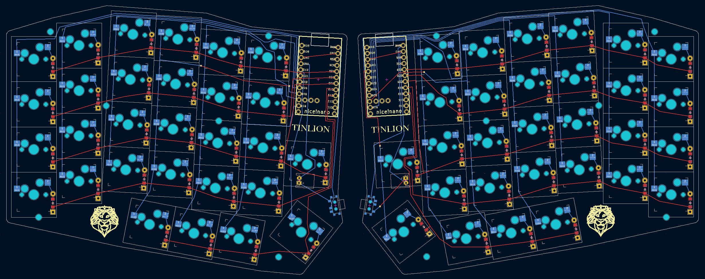

<picture>
    <source media="(prefers-color-scheme: dark)" srcset="docs/images/tinlion-logo-light.svg">
    <source media="(prefers-color-scheme: light)" srcset="docs/images/tinlion-logo-dark.svg">
    
</picture>

# ZMK CONFIG FOR THE TINLION SPLIT KEYBOARD

[Here](https://github.com/kammryndancy/tinlion-ergo-keyboard) you can find the hardware files and build guide.

This is a 58 key column-staggered split keyboard.

## KNOWN ISSUES
- Right side third and fifth row is being shifted to columns to the left, causing wrong input from board.